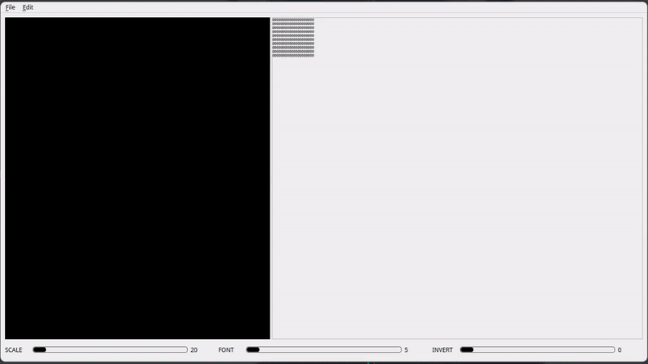
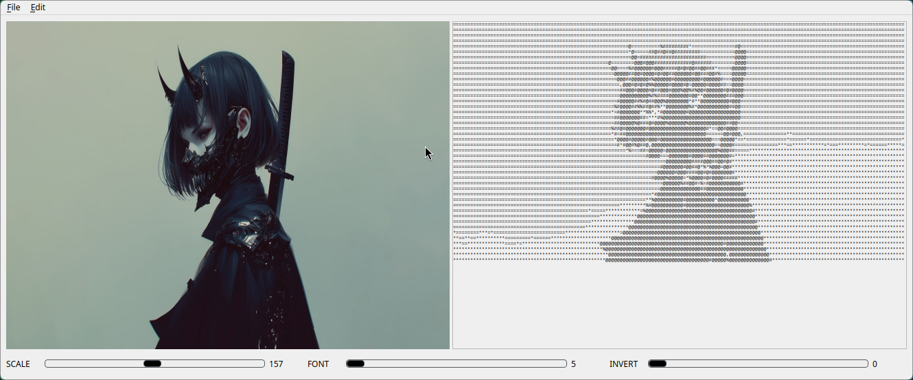

# ITAWI

Image To ASCII With Interface - used to convert images to ASCII symbols with GUI and multi-thread features.

## Installation

```sh
  git clone https://github.com/Aikai17/ITAWI
  cd ITAWI
  mkdir build
  cd build
  cmake ..
  make
  ```
## Usage



## Contact
t.me/Xaikaid
